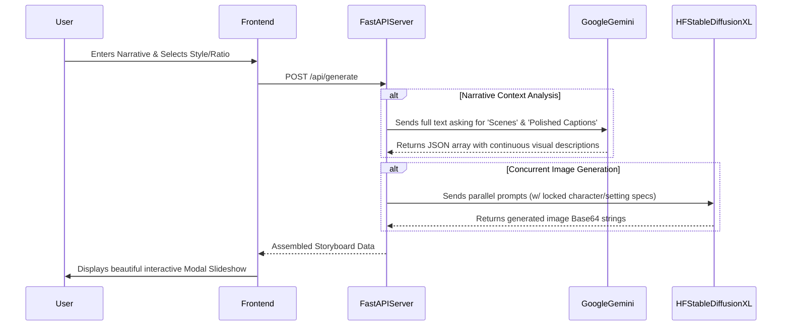

# The Pitch Visualizer 🚀

**The Pitch Visualizer** is an AI-powered cinematic application that translates success stories, narratives, and dry text into dynamic visual storyboards. Perfect for pitches, presentations, and product showcases.

This project was specifically assembled and stylized for the **Darwix assessment**.

Made with ❤️ by **Jatain**.

---

## 🏗️ Architecture Flow Diagram

Below is a visualization of how the components within the software communicate asynchronously to build perfect continuous storyboards!



---

## 📸 Core Features

- 🧠 **Holistic Contextual Continuity**: The backend reads your entire story *first* before segmenting it, so your characters and visual settings remain completely identical from frame 1 to frame 5 like a real movie!
- ✨ **Intelligent Caption Rewriting**: Extracts your raw bullet points and uses Gemini to write beautifully engaging script lines perfectly tuned for presentations.
- 📐 **Aspect Ratio Control**: Fully customizable text-to-image outputs (16:9, 1:1, 9:16).
- 🎞️ **Fluid Slideshow Interface**: Cinematic black minimalistic UI with synchronous progress bars.
- 🗂️ **Session History**: Automatically saves your generated storyboards locally during your active session, allowing you to seamlessly click back through your previous cinematic iterations without re-generating!
- 📁 **Offline PDF Exporting**: Client-side compiled PDF reports using `jsPDF`.

---

## 🛠️ Stack & Technologies Used

- **Backend**: Python, FastAPI
- **Frontend**: HTML5, Vanilla JavaScript, CSS3
- **Prompt Engineering Agent**: Google Gemini Models (`gemini-2.5-flash`)
- **Image Generation AI**: Hugging Face Inference API (`stabilityai/stable-diffusion-xl-base-1.0`)

---

## 🚀 Environment Setup

### Prerequisites
You need **two free API keys** to run this project:
1. **Google Gemini API Key**: [Google AI Studio](https://aistudio.google.com/app/apikey)
2. **Hugging Face Access Token**: [Hugging Face Settings](https://huggingface.co/settings/tokens)

### Quick Start
```bash
git clone https://github.com/yourusername/the-pitch-visualizer.git
cd the-pitch-visualizer

python -m venv venv
source venv/bin/activate  # On Windows: venv\Scripts\activate

pip install -r requirements.txt
```

Rename `.env.example` to `.env` and paste in your API keys.

```bash
uvicorn app:app --reload
```
Open **http://localhost:8000**!
